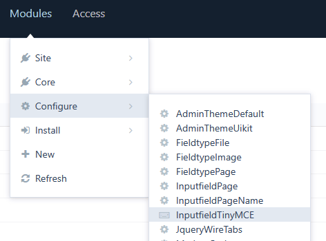
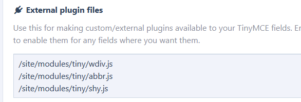
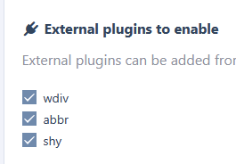
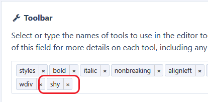
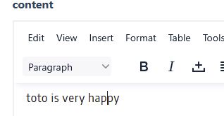
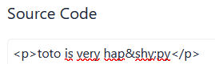

# Insert soft hyphen (&amp;shy;) in pw tinyMCE

easier it would be almost painful, sorry, I couldn't help myself 😀

obvious, but still...
**all you need is the js file; the assets folder just contains the images that decorate the blah blah blah you're reading right now.**

to install it in pw, put the js file where you want, e.g. /site/modules/tiny (up to you)
then go to modules -> configure -> InputfieldTinyMCE

and add the file path in the External plugin files textarea and save

now, in the field you want to use it, input tab, enable the plugin

and add it to the toolbar (using the select list or simply writing its name in the input and hit enter)

now you should see a new button

result, wherever your cursor is in the text,

click on the shy "button", and this is what will happen.

**a little something good to know**\
unlike CKEditor, as you can see, if you insert shoft hyphens in TinyMCE, you will see them in the source code of the field. Tiny must use its own HTML-style source code viewer to display them.

